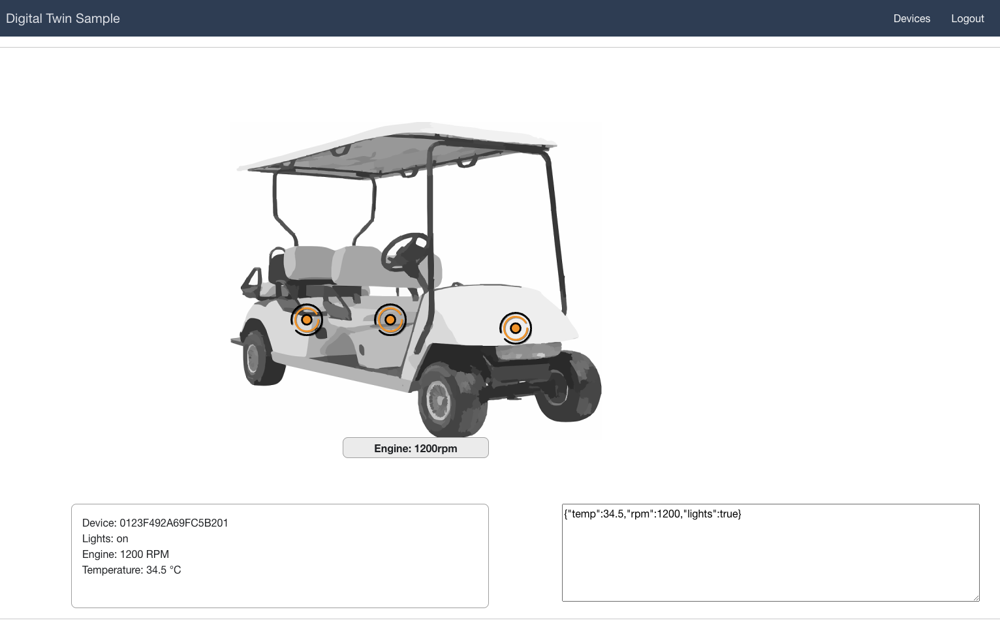

# AWS Digital Twin Frontend

## Summary
This project showcases a web application frontend for a digital twin (="virtual representation of an object or system") using AWS Amplify and the AWS IoT Device Shadow service. The AWS IoT Device Shadow service adds "shadows" to AWS IoT thing objects. Shadows can make a device’s state available to apps and other services whether the device is connected to AWS IoT or not. 
The frontend application allows you to list devices registered to AWS IoT Device Shadow and display each devices state, while receiving real-time state updates.

The project can be used as a starting point / boilerplate for your own digital twin projects.




## Prerequesites
### Device Shadow
To test this application, you should have at least one IoT thing registered with AWS IoT core and sending device shadow updates. Learn more about connecting devices to AWS IoT [here](https://docs.aws.amazon.com/iot/latest/developerguide/iot-connect-devices.html) and about the AWS IoT Device Shadow service [here](https://docs.aws.amazon.com/iot/latest/developerguide/iot-device-shadows.html).

If you own an AWS IoT EduKit, you can follow [this SmartThermostat workshop](https://catalog.us-east-1.prod.workshops.aws/workshops/0fc6bf2c-f59c-4490-9254-ef604942f5d3/en-US/smart-thermostat) to set up Device Shadow for your EduKit.

### Deployment Prerequesites
+ Access to an [AWS Account](https://aws.amazon.com/mobile/details/) with sufficient permissions

+ A local installation of [NodeJS](https://nodejs.org/en/download/) with [NPM](https://docs.npmjs.com/getting-started/installing-node)

+ Make sure that the AWS region you use is supporting IoT Deivce Shadow [Overview](https://aws.amazon.com/about-aws/global-infrastructure/regional-product-services/?nc1=h_ls).


+ The [AWS Ampify CLI](https://aws-amplify.github.io/)
  - `npm install -g @aws-amplify/cli`
  - `amplify configure` 

## Deployment Instructions

For a best experience ensure torun the complete project in a single region. We used for our demo purposes us-east-1; eu-central-1 and eu-west-1.

### 1. Clone this repo locally

```
git clone https://github.com/aws-samples/tbd.git
cd tbd
```

### 2. Deploy the Amplify project

```bash
   amplify init
```

Push the project
Note: This step will create AWS resources (S3 Bucket, Cognito User Pool, IAM Roles) 

```bash
   amplify push
   npm init
```

Add a hosting configuration to the project. When prompted, select a) Hosting with Amplify console

```bash 
   amplify add hosting
```
  
Finally, publish your project
     
```bash 
   amplify publish
```

In case the command was successfull you can open the URL provided which will redirect you to the Log In screen of the application 


### 3. Create User for Frontend in Amazon Cognito 

Amazon Cognito lets you add user sign-up, sign-in, and access control to your web and mobile apps quickly and easily. 
* Log into the AWS Manamgenet Console and search in the services for Amazon Cognito. 
* Open the existing User Pool and edit the option "User sign ups allowed?" to "Only allow administrators to create users". This prevents users from registering themselves.
* On the left tab click on "Users and groups" and create a new user 
* Switch to the URL from the previous step and log in with the credentials of the user that you've just created

### 4. Create IAM Policiy for AWS IoT

* Switch to the AWS Manamgement Console and follow Step 1 described [here](https://docs.amplify.aws/lib/pubsub/getting-started/q/platform/js/#aws-iot). 
* Go back to Cognito and open the identity pool created by your Amplify deployment ("Manage Identities"). Use the identity browser to look up the ID of your previously created user. It should look like this "cd613140-0d0d-4524-a946-4ab90327a9fb"
* Attach the iot-policy to the identity
```bash 
   aws iot attach-policy --policy-name <policy name step 5> --target <Identity ID>
```

### 5. Add you thing(s) to a thing group

In AWS IoT Core, create a thing group called `iot-twin-demo` and add the thing(s) that is/are publishing data to Device Shadow.

*Done! You will now be able to see your thing(s) listed in the frontend and can start customizing the application to your needs!*

## Pricing

As you can see the main components used in that project are:
* IoT Core
* Cognito
* S3

If you run it for demo purposes only all costs should be covered by our [free tier](https://aws.amazon.com/free/?nc1=h_ls&all-free-tier.sort-by=item.additionalFields.SortRank&all-free-tier.sort-order=asc&awsf.Free%20Tier%20Types=*all&awsf.Free%20Tier%20Categories=*all&all-free-tier.q=iot&all-free-tier.q_operator=AND)

In case you want to use that project as a baseline for your production or a larger PoC the costs heavily depend on your usage (data size, number of devices, users) therefor we would suggtest to use the [AWS calculator](https://calculator.aws) to run your on calucation.


